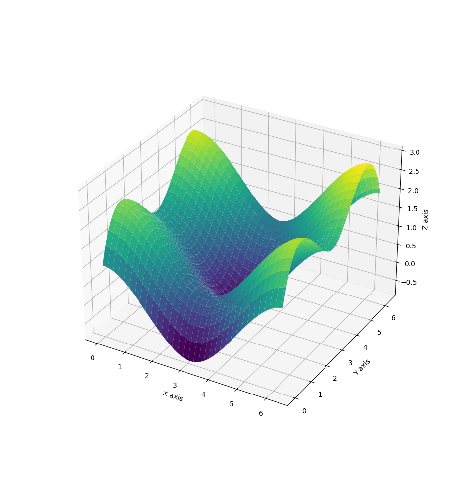

# Benchmark test of `GeomAPI_PointsToBSplineSurface`

## Background

For the make-face operation with BSpline-Surface-Fitting, Chinese testers found that the geometry service get stuck when the `minDegree = 179` and `maxDegree = 180`. And in the further tests, we also found other edge cases, like the `minDegree > maxDegree`, or the `tolerence` is too small for certain degree limits.

So we decide to make some  benchmark tests about the BSpline-Surface-fitting process.

## Implementation

I used a Python script to generate fitting points, and saved as a csv file. There are totally 25 points. and the fitted surface by scipy is shown below.



The OCCT test cases are written with Catch2 testing framework.

## Results

```
-------------------------------------------------------------------------------
Benchmark GeomAPI_PointsToBSplineSurface
-------------------------------------------------------------------------------
/home/chen/projects/lesson-12/main.cpp:76
...............................................................................

benchmark name                       samples       iterations    est run time
                                     mean          low mean      high mean
                                     std dev       low std dev   high std dev
-------------------------------------------------------------------------------
min=3, max=8, tol=0.01                         100             1    80.1425 ms 
                                         815.52 us    803.877 us    830.493 us 
                                        67.0653 us    55.4283 us    87.9755 us 
                                                                               
min=0, max=50, tol=0.01                        100             1    57.7694 ms 
                                        562.344 us    558.407 us    568.318 us 
                                          24.33 us    18.1233 us    35.8015 us 
                                                                               
min=179, max=180, tol=0.01                     100             1    126.822 ms 
                                        1.29883 ms    1.28368 ms    1.32056 ms 
                                        91.7648 us    68.4029 us    124.175 us 
                                                                               
min=1000, max=1000, tol=0.01                   100             1    130.185 ms 
                                        1.25938 ms    1.25135 ms     1.2724 ms 
                                        51.1589 us    36.1844 us    83.0774 us 
                                                                               
min=0, max=1, tol=0.01               Benchmark failed (Unknown exception) 

/home/chen/projects/lesson-12/main.cpp:76: FAILED:
due to unexpected exception with message:
  Unknown exception

===============================================================================
test cases: 1 | 1 failed
assertions: 1 | 1 failed
```

+ the fitting gets stuck, when `minDegree > maxDegree`.
+ the fitting fails quickly, when the `tolerence` is too small for the degree limits.
+ For the case `minDegree = 179` and `maxDegree = 180`, the fitting is also done quickly, which is different from the observation in geomtry service.
+ For general cases, the fitting process should be fast enough for the geometry service.
